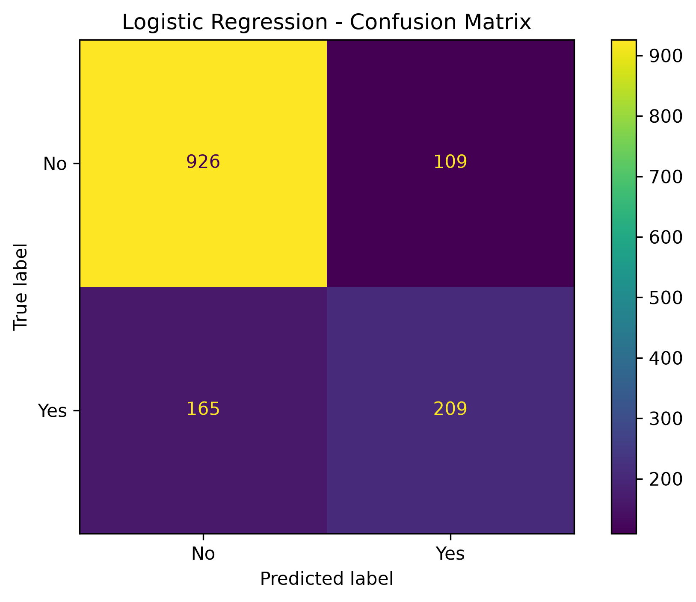
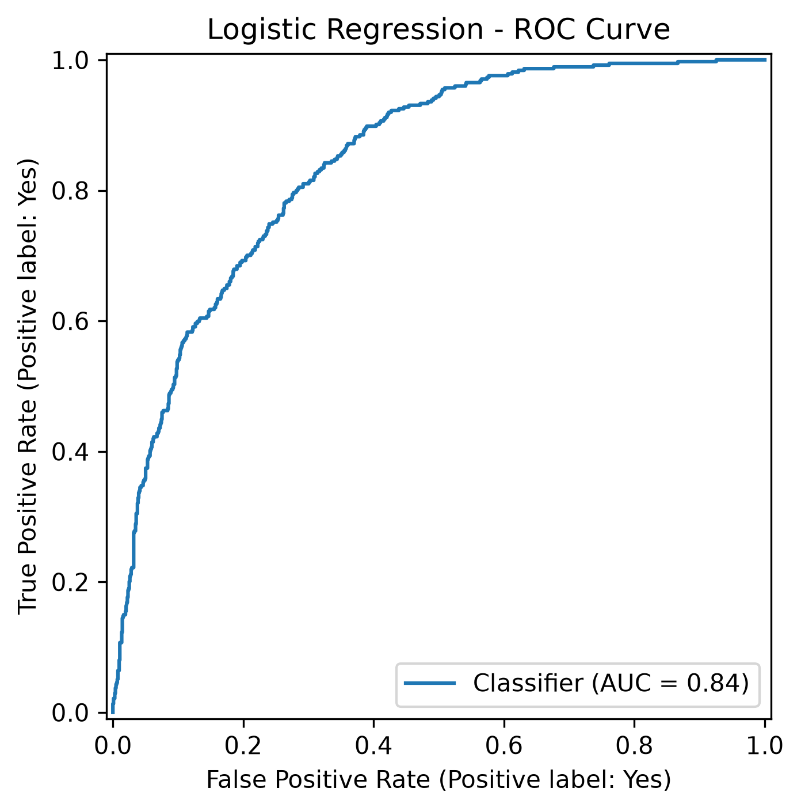
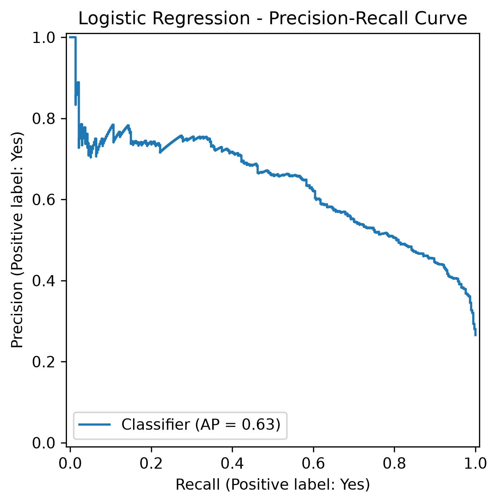

# Customer Churn Prediction

An end-to-end machine learning project that predicts whether a telecom customer is likely to churn using customer demographics, account information, subscribed services, contract details, and billing information.

## Project Objective

Customer churn directly affects recurring revenue and customer acquisition costs.

The objective of this project is to build a machine learning system that:

- Predicts customer churn probability
- Identifies high-risk customers
- Prioritizes recall for churn detection
- Provides an interpretable baseline for retention decisions

## Dataset

IBM Telco Customer Churn dataset.

- 7,043 customers
- 21 original columns
- Target: `Churn`
- Churn rate: ~26.5%

After removing `customerID` and separating the target, the model uses 19 input features.

## Project Workflow

1. Data exploration
2. Data cleaning
3. Missing-value handling
4. Train/test split
5. Categorical encoding
6. Numerical feature scaling
7. Logistic Regression baseline
8. Decision Tree experimentation
9. Random Forest experimentation
10. Cross-validation and hyperparameter tuning
11. Model comparison
12. Threshold analysis
13. Model explainability
14. Model serialization
15. Inference script

## Data Preprocessing

- Converted `TotalCharges` to numeric
- Handled 11 missing `TotalCharges` values associated with zero tenure
- Removed `customerID` from model features
- Used an 80/20 stratified train/test split
- Applied `StandardScaler` to numerical features for Logistic Regression
- Applied `OneHotEncoder` to categorical features
- Combined preprocessing and prediction using a scikit-learn `Pipeline`

## Models Evaluated

### Logistic Regression

At the default 0.50 threshold:

- Accuracy: 80.55%
- Churn Precision: 65.7%
- Churn Recall: 55.9%
- Churn F1: 60.4%
- ROC-AUC: 0.8420
- Average Precision: 0.6337

### Decision Tree

An unrestricted Decision Tree strongly overfit:

- Training Accuracy: 99.80%
- Test Accuracy: 72.96%

After controlling complexity and performing cross-validation, generalization improved substantially.

Best parameters found:

- `max_depth = 5`
- `min_samples_leaf = 10`
- `min_samples_split = 2`

Best cross-validation macro-F1: 0.7105

### Random Forest

The initial Random Forest also overfit:

- Training Accuracy: 99.80%
- Test Accuracy: 78.85%

After tuning:

- Training Accuracy: 84.40%
- Test Accuracy: 80.55%
- Churn Precision: 68%
- Churn Recall: 51%
- Churn F1: 58%
- ROC-AUC: 0.8411
- Average Precision: 0.6551

## Model Selection

Logistic Regression was selected as the final baseline model because it provided:

- Competitive test accuracy
- Better churn recall than the tuned Random Forest at the default threshold
- Better churn F1
- Similar ROC-AUC
- Easier model interpretation

Model selection was based on multiple evaluation metrics rather than accuracy alone.

## Model Evaluation Visualizations

### Confusion Matrix



### ROC Curve



### Precision-Recall Curve



## Threshold Analysis

Because identifying churners is important for retention, multiple classification thresholds were evaluated.

| Threshold | Precision | Recall | F1 |
|---:|---:|---:|---:|
| 0.30 | 0.519 | 0.754 | 0.615 |
| 0.35 | 0.543 | 0.706 | 0.614 |
| 0.40 | 0.568 | 0.668 | 0.614 |
| 0.45 | 0.601 | 0.615 | 0.608 |
| 0.50 | 0.657 | 0.559 | 0.604 |
| 0.55 | 0.678 | 0.463 | 0.550 |
| 0.60 | 0.718 | 0.401 | 0.515 |

A candidate threshold of **0.30** was selected for the demonstration inference workflow because it increases churn recall to approximately **75.4%**.

In a production system, the operating threshold should be selected using validation data and explicit business costs rather than repeated inspection of the test set.

## Model Insights

Features associated with higher predicted churn included:

- Fiber optic internet
- Month-to-month contracts
- Electronic check payments
- No online security
- No technical support

Features associated with lower predicted churn included:

- Longer customer tenure
- Two-year contracts
- DSL internet service

These are model associations and should not be interpreted as causal effects.

## Project Structure

```text
customer-churn-ml/
├── data/
│   └── raw/
│       └── telco_customer_churn.csv
├── models/
│   └── churn_model.joblib
├── notebooks/
│   └── 01_eda.ipynb
├── src/
│   └── customer_churn_ml/
│       └── predict.py
├── .gitignore
├── .python-version
├── pyproject.toml
├── README.md
└── uv.lock
```

## Run the Project

Install dependencies:

```bash
uv sync
```

Run churn prediction:

```bash
uv run python src/customer_churn_ml/predict.py
```

Example output:

```text
Churn Probability: 74.77%
Prediction: Yes
```

## Technologies

- Python
- Pandas
- NumPy
- Matplotlib
- scikit-learn
- Joblib
- Jupyter
- uv
- Git / GitHub

## Key Learning Outcomes

This project demonstrates:

- Exploratory data analysis
- Data preprocessing
- Prevention of data leakage
- Classification modeling
- Overfitting and regularization
- Cross-validation
- Hyperparameter tuning
- Model evaluation
- Precision-recall trade-offs
- ROC-AUC and Average Precision
- Classification threshold selection
- Model explainability
- Reproducible ML pipelines
- Model persistence and inference